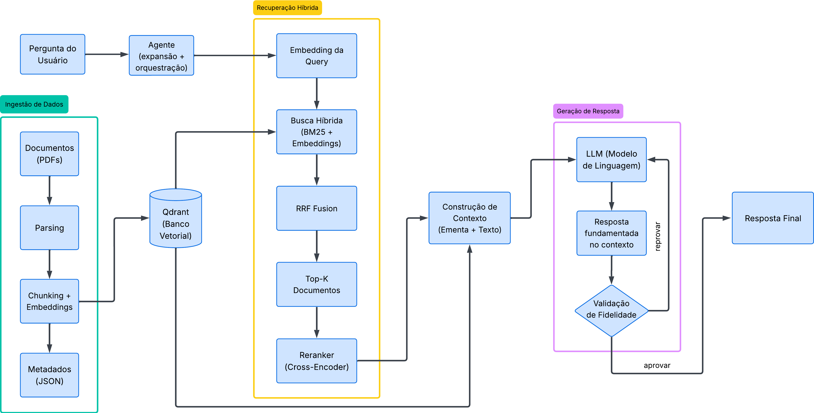

# RAG — Brazilian Electricity Sector

A **Retrieval-Augmented Generation (RAG)** system applied to technical and regulatory documents from the Brazilian electricity sector (ANEEL). The system combines hybrid search (BM25 + dense embeddings) with a LangGraph-based agent that performs query expansion (HyDE + reformulations), multi-step retrieval, answer generation using Claude, and automatic faithfulness verification. The interface is exposed via FastAPI and Streamlit.

---

## 🏗️ Architecture

```

PDF, XLSX, and other documents
│
▼
┌───────────────────────────────────────────────────────┐
│  Parsing & Indexing                                   │
│  PyMuPDF and others → Chunks → Embeddings → Qdrant    │
│  BM25Retriever (local sparse index)                   │
└───────────────────────────────────────────────────────┘
│
▼
┌───────────────────────────────────────────────────────┐
│  Hybrid Retrieval                                     │
│  BM25 + Dense → RRF Fusion → Reranker                 │
│  (CrossEncoderReranker)                               │
└───────────────────────────────────────────────────────┘
│
▼
┌───────────────────────────────────────────────────────┐
│  LangGraph Agent                                      │
│  query_analyzer → query_expander →                    │
│  retriever → reranker →                               │
│  context_assembler → generator →                      │
│  faithfulness_check (self-correction loop)            │
└───────────────────────────────────────────────────────┘
│
├─── FastAPI  (app/api.py) → [http://localhost:8000](http://localhost:8000)
└─── Streamlit (app/ui.py) → [http://localhost:8501](http://localhost:8501)

````

## 🧠 Architecture Diagram

<p align="center">
  
</p>

---

## ⚙️ Prerequisites

To run this project, your machine must have:

* **Docker**
* **Docker Compose**
* **Google Cloud SDK (gcloud CLI)** (for data/snapshot synchronization)
* A valid **Anthropic (Claude)** API key

---

## 🚀 Quick Start Guide (Step-by-Step)

### Step 0: Clone the Repository

```bash
git clone https://github.com/buenofgustavo/desafio-agentes-nlp.git
cd desafio-agentes-nlp
````

---

### Step 1: Configure the API Key

At the root of the project, there is a `.env.example` file.

1. Rename it to `.env`
2. Open it and add your Anthropic API key:

```env
ANTHROPIC_API_KEY=sk-ant-your-key-here...
```

---

### Step 2: Download the Database Snapshot

```bash
mkdir -p qdrant_setup

gcloud storage cp gs://aneel-raw-data/qdrant-snapshot/desafio-agentes-nlp.snapshot qdrant_setup/
```

---

### Step 3: Start the Infrastructure

```bash
docker-compose up -d
```

---

### Step 4: Restore the Vector Database (Qdrant)

```bash
curl -v -X PUT 'http://localhost:6333/collections/setor_eletrico/snapshots/recover' \
-H 'Content-Type: application/json' \
-d '{"location": "file:///qdrant/snapshots/desafio-agentes-nlp.snapshot"}'
```

⏳ **Note:** This process may take several minutes and might appear to hang.

To monitor progress:

```bash
docker logs -f qdrant_setor_eletrico
```

---

### Step 5 (Optional): Build the BM25 Index

```bash
docker exec -it rag_api_setor_eletrico python -m src.retrieval.bm25_retriever --rebuild
```

---

### Step 6: Access the Application

👉 [http://localhost:8501](http://localhost:8501)

---

## 🗄️ Data Management and Scripts

All processed data, raw documents, and Qdrant snapshots are stored in our **GCP (Google Cloud Platform)** bucket.

This ensures:

* **Fast replication** for quick setup
* **Up-to-date data** as a single source of truth

Useful commands are available in the `Makefile`:

* `make sync-data`
* `make sync-processed-json`
* `make sync-qdrant-snapshot`

The `scripts/` folder contains executable pipeline steps for ingestion, indexing, and setup.

---

## 📁 Project Structure

```
desafio-agentes-nlp/
├── app/
│   ├── api.py              # FastAPI — inference and healthcheck endpoints
│   └── ui.py               # Streamlit UI for user interaction
├── data/
│   ├── raw/                # Raw documents (PDF, XLSX, etc.)
│   └── processed/          # Processed chunks in JSON format
├── qdrant_setup/           # Qdrant snapshots and configuration files
├── scripts/
│   ├── download_dataset.py # Dataset download (JSONs)
│   ├── run_indexing.py     # Indexing and embedding pipeline
│   ├── run_ingestion.py    # Document ingestion pipeline
│   ├── run_agent.py        # CLI agent execution
│   └── setup_collection.py # Qdrant collection setup
├── src/
│   ├── agent/              # LangGraph agent logic
│   │   ├── graph.py        # Graph definition and compilation
│   │   ├── nodes.py        # Node implementations
│   │   ├── state.py        # Agent state schema
│   │   └── query_expansion.py # Query expansion (HyDE)
│   ├── ai/
│   │   ├── embeddings/     # Vector generation (all-MiniLM-L6-v2)
│   │   └── llm/            # LLM clients (Anthropic, OpenAI, Ollama)
│   ├── core/
│   │   ├── config.py       # Environment configuration
│   │   └── models.py       # Pydantic models
│   ├── indexing/           # Ingestion, processing, and storage
│   ├── retrieval/          # Search strategies (BM25, semantic, hybrid)
│   └── utils/
```

---

## ⚙️ Key Design Decisions

| Decision                                     | Rationale                                                                        |
| -------------------------------------------- | -------------------------------------------------------------------------------- |
| **Hybrid retrieval (BM25 + dense) with RRF** | Combines keyword recall with semantic understanding; robust to score differences |
| **Cross-encoder reranking**                  | Higher precision ranking than bi-encoders                                        |
| **LangGraph orchestration**                  | Clean state management and multi-step workflows                                  |
| **HyDE + query reformulation**               | Improves recall for ambiguous queries                                            |
| **FastAPI + Streamlit separation**           | Decoupled backend and frontend                                                   |

---

## 🕵️‍♂️ Data Extraction

During ANEEL document downloads, the standard `requests` library was often blocked.

Solution: `curl_cffi` with sessions

* **Browser impersonation:** Mimics real browsers to bypass Cloudflare
* **Session handling:** Maintains cookies and reuse connections (keep-alive), improving performance

---

## 👨‍💻 Team

* **Igor Reis Braziel** — [braziel@discente.ufg.br](mailto:braziel@discente.ufg.br)
* **Gustavo Bueno Ferreira** — [gustavobueno2@discente.ufg.br](mailto:gustavobueno2@discente.ufg.br)
* **Breno Machado Barros** — [breno_machado@discente.ufg.br](mailto:breno_machado@discente.ufg.br)
